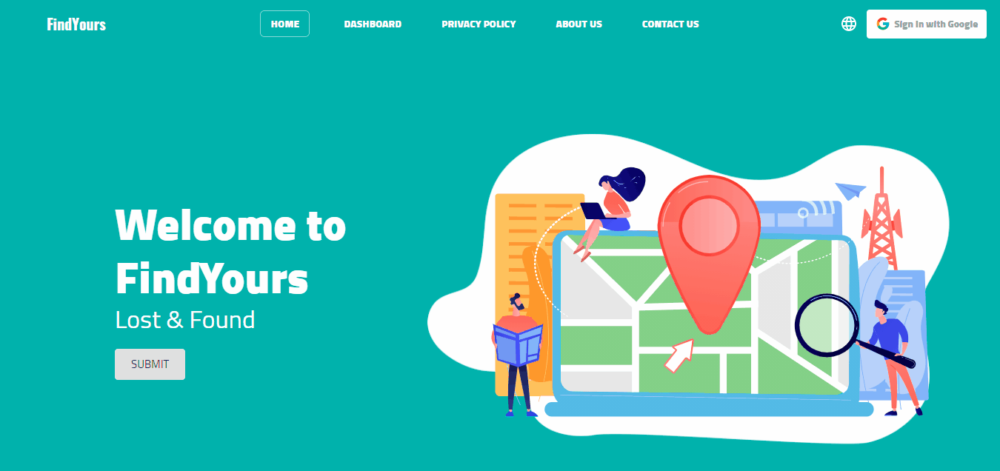

# FindYours web application

"FindYours" is a web application that helps people who have lost a valuable item to easily find it and to allow people who find things to share them on our platform.  

## Live Demo

View the [live demo](https://findyours.netlify.app/)!

## Site Map

First you open our web application you will see a userfriendly Navbar, Home page, and Footer.
In Navbar you can see:

- earth icon to change the language from `English` to `Arabic` or to `Kurdish` language.
- a `Google Sign in` button to sign in with your google account.
- four tabs (`Home`, `Dashboard`, `About Us`, `Contact Us`, `Privacy Policy`) each of them will navigate to the desired page.

.png>)   

In Home page you can see:

- submit buttton to submit posts of lost or found items.
- information section where give you information about what our web application can do for you.
- featured lost items where you can see your recently featured Lost property.

   

In Dashboard page you can see:

- searchbar to search for posts of lost or found items.
- submit button to submit posts of lost and found items.
- cities and filters for filtering posts.

.png>)   

In Profile page you can see your information and all your posts.

  

On the View Post page, you can see item information and contact information.

.png>)   

In Privacy Policy we will inform you about how our web application handles your personal information.

.png>)   

In Contact Us you can reach out to us and send us your feedback with your email address also in Footer you can see social icons where you can visit our social media pages.

.png>)   

In About Us, know more about our web application also you can see our team developer and reach out to them with their social accounts.

   

## How to use

##### For posting lost or found items

- first, you should sign in with the (Sign in with Google) button in the navbar.
- then, click on the submit button on the Dashboard page will take you to the Form page.
- after that, by filling the required fields on the Form page now you are ready to submit the post that will be shown on the Dashboard page.
- finally, to see all your posts you can go to your Profile page by clicking on your avatar in the Navbar.

##### To delete or edit your post

- go to the profile page, click on the `View Post` button on your post.
- in the view post page click on the `Delete` button or `Edit` button to edit or delete your post.

##### To search for a post

- you can use Search Bar to search for posts of lost or found items on the Dashboard page.
  OR
- you can filter posts using city and filter options on the Dashboard page.

##### To change language

- you can change language from English to Arabic or to the Kurdish language by clicking on the earth icon in the navbar will show you the menu of languages.

### Built With

- [React](https://reactjs.org/)- A JavaScript library for building user interfaces.
- [Firebase](https://firebase.google.com/)- A Backend-as-a-Service, it is categorized as a NoSQL database program, which stores data in JSON-like documents.

### Dependencies

- Node: [http://nodejs.org/](http://nodejs.org/)
- ReactJS: [https://reactjs.org](https://reactjs.org)
- React-Router: [https://reactrouter.com/](https://reactrouter.com/)
- Material-UI: [https://material-ui.com/](https://material-ui.com/)
- React-Responsive: [https://www.npmjs.com/package/react-responsive](https://www.npmjs.com/package/react-responsive)
- i18next: [https://react.i18next.com/getting-started](https://react.i18next.com/getting-started)
- Framer-motion: [https://www.framer.com/motion/](https://www.framer.com/motion/)
- Firebase: [https://firebase.google.com/](https://firebase.google.com/)
- React-icons: [https://react-icons.github.io/react-icons/](https://react-icons.github.io/react-icons/)

### Initial Set Up

1. Clone the repository.
2. `npm install` or `yarn`.
3. `npm start` or `yarn start` app start with your port number.

### Contributing

1. Fork it (https://github.com/murtaja1/find_yours/fork).
2. Create your feature branch (`git checkout -b feature/fooBar`).
3. Commit your changes (`git commit -am 'Add some fooBar'`).
4. Push to the branch (`git push origin feature/fooBar`).
5. Create a new Pull Request.

---
